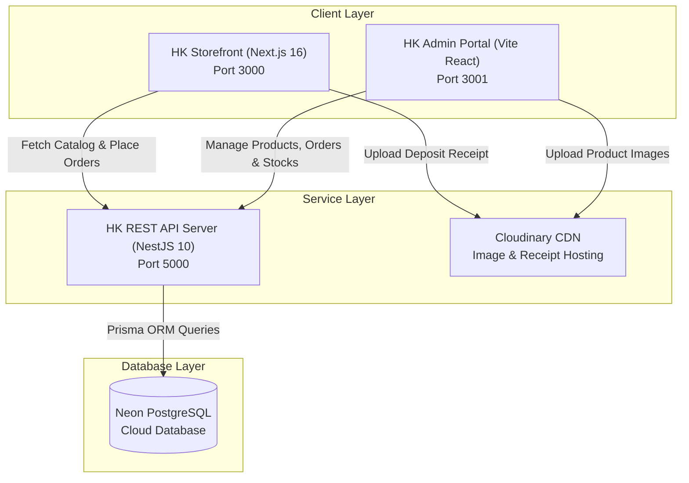
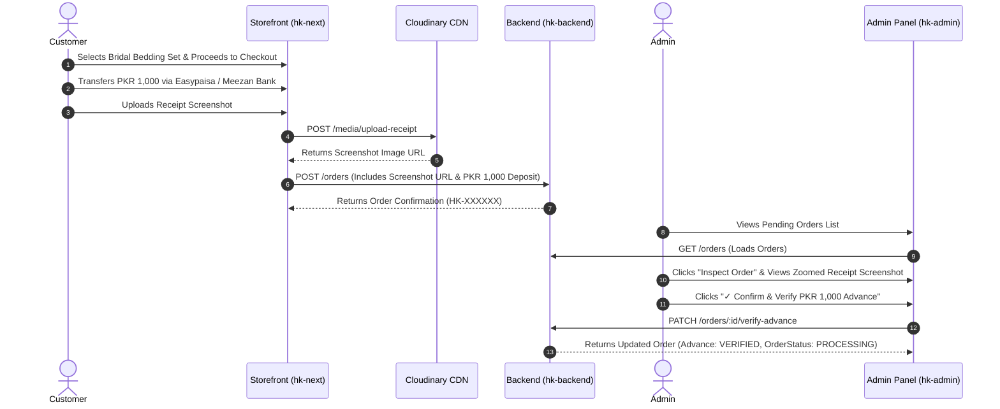

# 📖 Full Project Documentation: HK Fabric Luxury E-Commerce & Retail Management System

**Author / Project Lead:** Full-Stack Developer  
**Internship Identifier:** ZYNVEX-CERT-0000  
**Repository:** [MuhammadAhsankhan786/hk-ecom-store](https://github.com/MuhammadAhsankhan786/hk-ecom-store)  
**Date:** September 20, 2026  

---

## 📋 Table of Contents
1. [Executive Summary & Objectives](#1-executive-summary--objectives)
2. [System Architecture & Data Flow](#2-system-architecture--data-flow)
3. [Module 1: Storefront Development (hk-next)](#3-module-1-storefront-development-hk-next)
4. [Module 2: REST API Backend Engine (hk-backend)](#4-module-2-rest-api-backend-engine-hk-backend)
5. [Module 3: Back-Office Admin Dashboard (hk-admin)](#5-module-3-back-office-admin-dashboard-hk-admin)
6. [Module 4: COD + PKR 1,000 Advance Deposit Payment Verification Workflow](#6-module-4-cod--pkr-1000-advance-deposit-payment-verification-workflow)
7. [Database Schema & Entity Relationship Diagram](#7-database-schema--entity-relationship-diagram)
8. [Security, Concurrency & Quality Assurance](#8-security-concurrency--quality-assurance)
9. [Deployment & Local Setup Guide](#9-deployment--local-setup-guide)

---

## 1. Executive Summary & Objectives

The **HK Fabric E-Commerce & Retail Management System** is an end-to-end digital retail platform engineered specifically for Pakistan's premier home textiles market (velvet bridal bedding sets, cotton quilted comforters, luxury duvets, and bath towel sets).

### 🎯 Key Engineering Goals
- **Eliminate Fake COD Orders**: Implement a hybrid Cash on Delivery (COD) mechanism requiring a **PKR 1,000 Advance Deposit** via Easypaisa or Bank Transfer with screenshot proof verification.
- **Race-Condition Free Stock Reservations**: Prevent overselling high-demand bridal sets through single-statement SQL atomic stock decrements.
- **Idempotent Order Submission**: Guarantee zero duplicate orders during network lag or accidental retry clicks via custom HTTP `x-idempotency-key` guards.
- **Decoupled 3-Tier Architecture**: Separate high-performance Next.js 16 Storefront, NestJS REST API Server, and Vite React Admin Dashboard.

---

## 2. System Architecture & Data Flow



---

## 3. Module 1: Storefront Development (`hk-next`)

### Tech Stack
- **Framework**: Next.js 16.3 (App Router)
- **Styling**: Vanilla Tailwind CSS with custom HSL tokens, dark mode palette, and gold `#D4AF37` luxury accents.
- **Typography**: Google Fonts Inter (sans-serif) & Playfair Display (serif).

### Core Features
1. **Interactive Luxury Catalog**:
   - Filter by Category (Bridal Sets, Cotton Bedsheets, Fleece Blankets, Towel Sets).
   - Filter by Collection (Royal Bridal Collection, Summer Cotton Collection).
   - Real-time search by title, SKU, or material.

2. **Step-by-Step Checkout & Advance Payment**:
   - **Step 1: Contact Information**: Name, Email, Phone number.
   - **Step 2: Delivery Address**: Street address, City, Province, Postal code.
   - **Step 3: Order Review**: Financial breakdown (Subtotal, Shipping fee, Total).
   - **Step 4: Deposit Screenshot Upload & COD Breakdown**:
     - Official Easypaisa (`0300 1234567`) & Meezan Bank (`PK36MEZN00012345678901`) details.
     - Direct file uploader pushing screenshots to Cloudinary CDN (`POST /media/upload-receipt`).
     - Display: **Advance Deposit Payable NOW (PKR 1,000)** vs **Remaining COD at Doorstep (Total - 1,000)**.

3. **Order Confirmation & Verification Tracker**:
   - Server-side order verification querying `GET /orders/:id`.
   - Displays live status: `⏳ PKR 1,000 Advance Verification Pending`, `✅ Verified`, or `⚠️ Rejected`.

---

## 4. Module 2: REST API Backend Engine (`hk-backend`)

### Tech Stack
- **Framework**: NestJS 10 Framework with TypeScript
- **Database ORM**: Prisma ORM 7.9 with Neon PostgreSQL Cloud DB
- **Documentation**: Swagger OpenAPI (`http://localhost:5000/api`)

### Key API Endpoints
| HTTP Method | Endpoint | Description | Guard |
| :--- | :--- | :--- | :--- |
| `POST` | `/orders` | Create new order (Idempotency protected) | None (Public) |
| `GET` | `/orders/:idOrNumber` | Get order details & verification status | Optional JWT |
| `PATCH` | `/orders/:id/verify-advance` | Verify or reject PKR 1,000 deposit receipt | JWT + Admin Roles |
| `PATCH` | `/orders/:id/status` | Update fulfillment state machine status | JWT + Admin Roles |
| `POST` | `/media/upload-receipt` | Upload customer deposit receipt screenshot | None (Public) |
| `POST` | `/auth/login` | Authenticate admin user & issue JWT token | None (Public) |

---

## 5. Module 3: Back-Office Admin Dashboard (`hk-admin`)

### Credentials
- **URL**: `http://localhost:3001`
- **Email**: `admin@hkfabric.pk`
- **Password**: `admin123`

### Key Administrative Workflows
1. **Catalog Management**:
   - Product creation with title, slug, price, cost price, material, fabric thread count, stock rules, and Cloudinary gallery.
   - Parent & Subcategory taxonomy tree configuration.

2. **Deposit Receipt Proof Viewer & Verification**:
   - Badge filters: `Pending Receipts`, `Verified Advance`, `Processing`, `Shipped`.
   - Click-to-zoom deposit receipt screenshot modal.
   - One-click **"✓ Confirm & Verify PKR 1,000 Advance"** action.

3. **Inventory Audit Logging**:
   - Records every stock change with timestamp, user ID, reason, and IP address.

---

## 6. Module 4: COD + PKR 1,000 Advance Deposit Payment Verification Workflow



---

## 7. Database Schema & Entity Relationship Diagram

```prisma
model Order {
  id                   String        @id @default(uuid())
  orderNumber          String        @unique
  customerName         String
  customerEmail        String
  customerPhone        String
  shippingAddress      String
  city                 String
  subtotal             Float
  discount             Float         @default(0)
  shippingFee          Float         @default(0)
  totalAmount          Float
  advancePaymentAmount Float         @default(1000)
  remainingCodAmount   Float         @default(0)
  paymentScreenshot    String?
  advancePaymentStatus String        @default("PENDING") // PENDING | VERIFIED | REJECTED
  orderStatus          OrderStatus   @default(PENDING)
  paymentStatus        PaymentStatus @default(PENDING)
  items                OrderItem[]
  createdAt            DateTime      @default(now())
  updatedAt            DateTime      @updatedAt
}
```

---

## 8. Security, Concurrency & Quality Assurance

### 🔒 Security Controls
- **Bcrypt Hashing**: Passwords stored with salt factor 10.
- **JWT Authorization**: 7-day expiration with role claims (`SUPER_ADMIN`, `STORE_MANAGER`).
- **Prisma Parameterized Queries**: Complete protection against SQL Injection.

### ⚡ Concurrency & Race-Condition Control
```typescript
// Single atomic SQL statement prevents negative inventory counts under concurrent load
const updateResult = await tx.product.updateMany({
  where: {
    id: targetProductId,
    isArchived: false,
    stock: { gte: item.quantity },
  },
  data: {
    stock: { decrement: item.quantity },
  },
});
```

---

## 9. Deployment & Local Setup Guide

### System Requirements
- Node.js `v20.0.0` or higher
- PostgreSQL Cloud DB (Neon PostgreSQL)

### Running Commands

#### 1. Backend REST Server
```bash
cd hk-backend
npm install
npx prisma db push
npm run dev
```

#### 2. Admin Portal
```bash
cd hk-admin
npm install
npm run dev
```

#### 3. Storefront
```bash
cd hk-next
npm install
npm run dev
```

---
*Documentation compiled and verified for ZYNVEX Internship Final Submission.*
